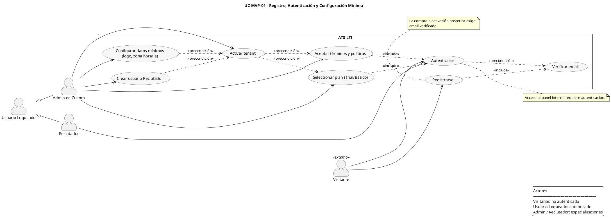
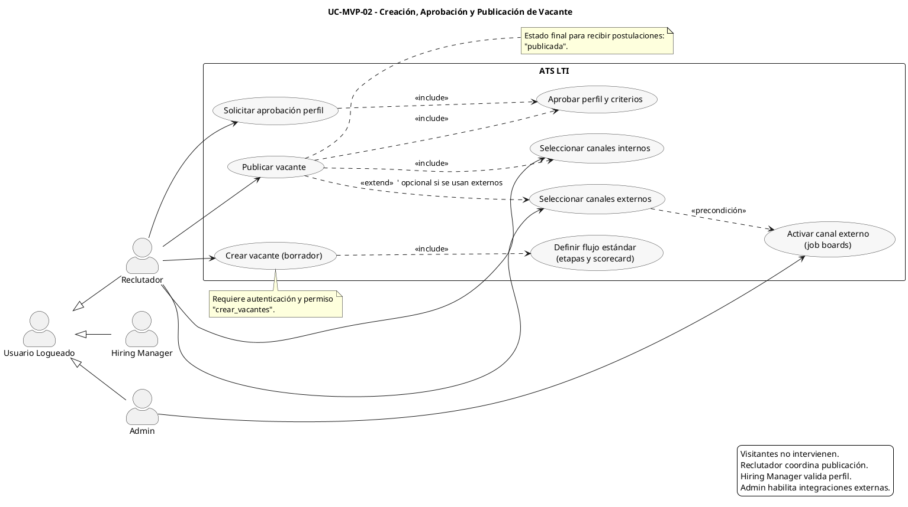
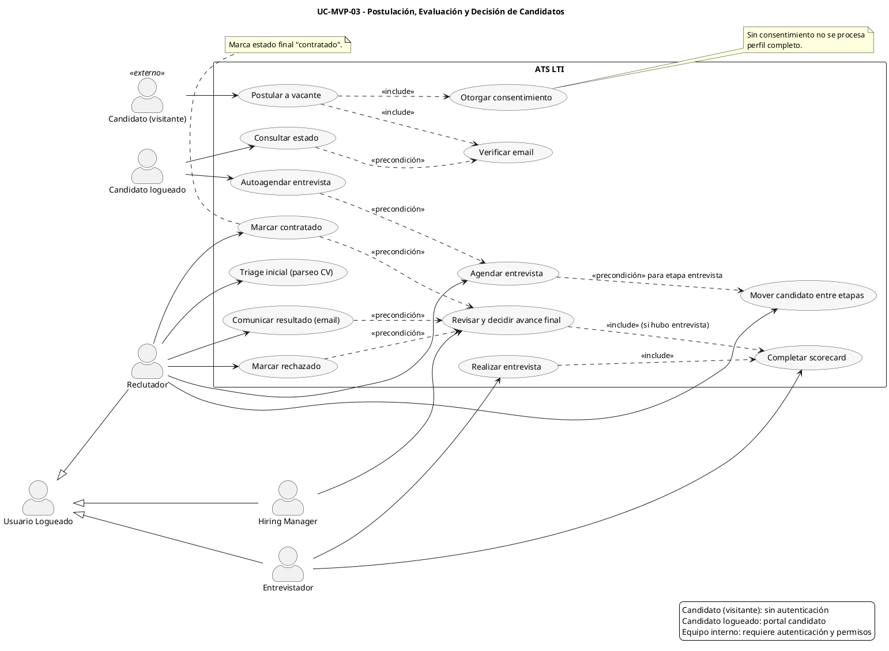
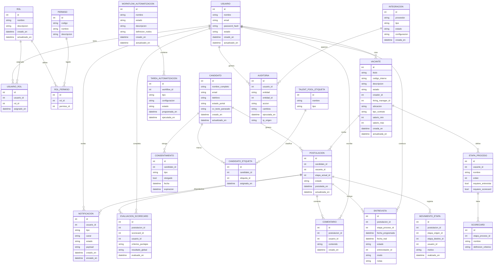
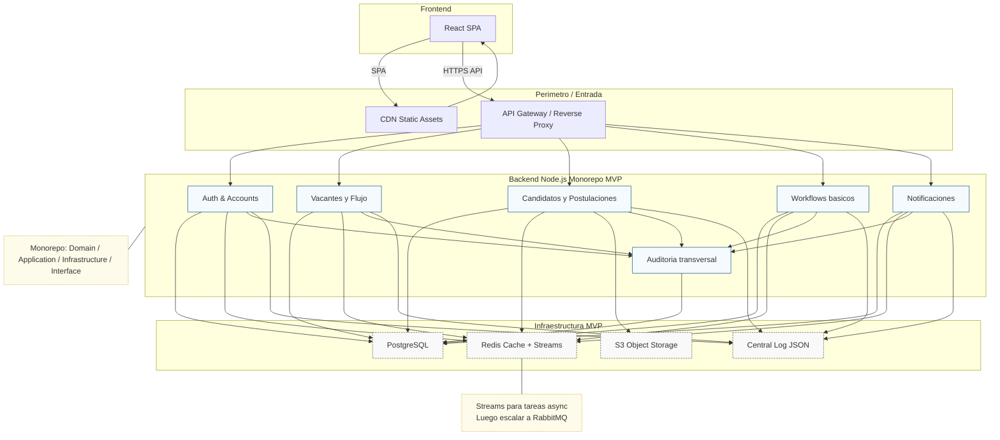

# Índice
1. Descripción breve del software LTI  
2. Valor añadido y ventajas competitivas  
3. Funciones principales del sistema 
4. Diagrama Lean Canvas del software LTI
5. Casos de uso principales (UML)
6. Diagrama de modelo de datos (ERD)
7. Diseño del sistema alto nivel (Arquitectura)
8. Diagramas C4

---

# 1. Descripción breve del software LTI
**LTI** es un Applicant Tracking System (ATS) moderno diseñado para optimizar, automatizar y escalar los procesos de reclutamiento dentro de organizaciones medianas y grandes. Su enfoque principal es ofrecer una experiencia fluida tanto para candidatos como para equipos de reclutamiento, combinando analítica avanzada, colaboración en tiempo real y automatizaciones configurables.  
El objetivo central es reducir tiempos, mejorar la calidad de las contrataciones y elevar el nivel de eficiencia operativa en los departamentos de HR.

---

# 2. Valor añadido y ventajas competitivas
LTI se diferencia de los ATS tradicionales gracias a estas capacidades clave:

### **2.1 Experiencia del candidato superior (CX)**
- Procesos de postulación simples y rápidos.  
- Seguimiento del estado de candidatura en tiempo real.  
- Reducción de fricción y aumento en la tasa de conversión.

### **2.2 Analítica avanzada y dashboards inteligentes**
- Reportes detallados sobre embudos, tiempos, fuentes y eficiencia.  
- Predicciones basadas en datos (ej. tiempos estimados de contratación).  
- Personalización de métricas para cada rol o equipo.

### **2.3 Integraciones robustas y simples**
- Conexiones plug-and-play con HRIS, ERPs, plataformas de entrevistas, firmas electrónicas y sistemas de evaluación.  
- API pública y webhooks para extender funcionalidades sin depender del core.  

### **2.4 Gestión centralizada y estratégica del talento**
- Talent Pool unificado con etiquetas inteligentes.  
- Reengagement automático de talento existente.  
- Búsqueda avanzada de perfiles almacenados.

### **2.5 Colaboración en tiempo real**
- Comentarios internos estilo “Google Docs” dentro de cada perfil.  
- Scorecards colaborativos y votaciones.  
- Canales por vacante para comunicación estructurada.

### **2.6 Automatizaciones configurables**
- Workflows visuales al estilo “low-code”.  
- Reglas dinámicas para mover candidatos, enviar correos, asignar tareas o generar recordatorios.  
- Minimización del trabajo repetitivo y operacional.

### **2.7 Movilidad total**
- Aplicación móvil para reclutadores y managers.  
- Aprobaciones, comentarios y revisiones desde cualquier dispositivo.  

### **2.8 Escalabilidad y soporte para organizaciones complejas**
- Multi–equipo, multi–rol y controles de permisos granulares.  
- Gestión de múltiples marcas, países o unidades de negocio.  
- Alto rendimiento y arquitectura preparada para crecimiento.

### **2.9 Seguridad y cumplimiento por diseño**
- Auditoría completa de acciones internas.  
- Cumplimiento con GDPR, CCPA y normativas locales.  
- Encriptación de datos sensibles y gestión de consentimiento.

### **2.10 Employer Branding personalizable**
- Portales de empleo adaptados a la identidad visual de cada empresa.  
- Plantillas modernas que destacan cultura y beneficios.  
- Publicación directa en múltiples canales.

### **2.11 Modularidad y extensibilidad**
- Activación de módulos según necesidades del cliente.  
- Marketplace para integraciones, evaluaciones y extensiones.  
- Flexibilidad para adaptarse a sectores, tamaños y presupuestos.

### **2.12 Personalización profunda**
- Flujos independientes por vacante o equipo.  
- Interfaces diferenciadas según rol.  
- Configuración granular sin necesidad de desarrollos adicionales.

> **Duplicados revisados:**  
No existían duplicados textuales, pero se consolidaron ideas similares (por ejemplo, personalización y modularidad) para evitar redundancias.

---

# 3. Funciones principales del sistema

## **3.1 Publicación y gestión de vacantes**
- Creación de vacantes con plantillas.  
- Publicación en múltiples portales y redes sociales.  
- Configuración de flujos específicos por rol.

## **3.2 Gestión del ciclo completo del candidato**
- Recepción centralizada de postulaciones.  
- Perfil enriquecido con CV parsing.  
- Movimientos entre etapas del proceso.

## **3.3 Matching y sugerencias inteligentes**
- Recomendación automática de candidatos ideales.  
- Identificación de perfiles dentro del Talent Pool existente.

## **3.4 Colaboración interna**
- Comentarios, discusiones y anotaciones dentro del perfil.  
- Scorecards y evaluaciones comparativas.  
- Aprobaciones en cadena.

## **3.5 Automatizaciones**
- Creación de workflows para emails, tareas y transiciones.  
- Reglas basadas en eventos (por ejemplo, “cuando un candidato entra en etapa X…”).

## **3.6 Analítica y reportes**
- Dashboard general y dashboards por rol.  
- Embudos de contratación, métricas de eficiencia y predicciones.  

## **3.7 Integraciones**
- Con calendarios, HRIS, plataformas de videoentrevistas y evaluaciones.  
- API y webhooks para conectarse con sistemas externos.

## **3.8 Talent Pool inteligente**
- Búsqueda avanzada.  
- Segmentación por etiquetas dinámicas.  
- Reengagement automatizado.

## **3.9 Portal del candidato**
- Postulación rápida.  
- Seguimiento de estado en tiempo real.  
- Recepción de notificaciones y feedback.

## **3.10 Seguridad y cumplimiento**
- Gestión de consentimiento.  
- Roles y permisos avanzados.  
- Auditoría completa de todas las acciones.

## **3.11 Personalización y branding**
- Portales adaptados a la marca del cliente.  
- Configuración visual del sitio de empleo.  

---

# 4. Diagrama Lean Canvas del software LTI

## **4.1 Imagen del diagrama Lean Canvas desde Drawio**


## **4.2 Diagrama Lean Canvas con mermaid**

```mermaid  
flowchart LR
    %% ORIENTACIÓN
    %% El diagrama completo fluye de izquierda a derecha

    %% --- Fila superior ---
    subgraph P1[Problema]
    direction TB
    p1a[• Procesos lentos y poco eficientes]
    p1b[• Falta de colaboración]
    p1c[• Herramientas poco adaptables]
    p1d[• Tareas manuales excesivas]
    p1e[• Baja visibilidad en métricas]
    end

    subgraph S1[Segmentos de Cliente]
    direction TB
    s1a[• Empresas medianas y grandes]
    s1b[• HR / Talent Acquisition]
    s1c[• Hiring Managers]
    s1d[• Organizaciones multinacionales]
    end

    subgraph PV[Propuesta de Valor Única]
    direction TB
    pv1[ATS moderno centrado en:\n• Colaboración en tiempo real\n• Automatizaciones avanzadas\n• Analítica inteligente\n• Movilidad\n• Seguridad\n• Personalización profunda\n• Talent Pool centralizado]
    end

    subgraph SOL[Solución]
    direction TB
    sol1[• Dashboards inteligentes y predicciones]
    sol2[• Talent Pool dinámico]
    sol3[• Portales personalizables]
    sol4[• Automatizaciones visuales]
    sol5[• Colaboración tipo Google Docs]
    sol6[• Integraciones plug-and-play]
    sol7[• App móvil para reclutamiento]
    end

    %% --- Fila intermedia ---
    subgraph CAN[Canales]
    direction TB
    can1[• Portal de empleo]
    can2[• Bolsas de trabajo]
    can3[• Redes sociales]
    can4[• Integraciones HRIS/ERP]
    can5[• Marketplace]
    end

    subgraph FI[Fuentes de Ingreso]
    direction TB
    fi1[• Suscripción mensual/anual]
    fi2[• Módulos premium]
    fi3[• Integraciones especializadas]
    fi4[• Servicios profesionales]
    end

    subgraph EC[Estructura de Costos]
    direction TB
    ec1[• Infraestructura cloud]
    ec2[• Desarrollo y soporte]
    ec3[• Integraciones y marketplace]
    ec4[• Seguridad y cumplimiento]
    end

    subgraph KPI[Indicadores Clave]
    direction TB
    k1[• Time-to-hire]
    k2[• Cost-to-hire]
    k3[• Conversión por etapa]
    k4[• Efectividad de fuentes]
    k5[• Actividad y colaboración]
    k6[• Uso de automatizaciones]
    end

    %% --- Fila inferior ---
    subgraph VC[Ventaja Competitiva]
    direction TB
    vc1[• Colaboración en tiempo real]
    vc2[• Automatizaciones low-code]
    vc3[• Talent Pool inteligente]
    vc4[• Dashboards personalizados]
    vc5[• Branding totalmente adaptable]
    vc6[• Escalabilidad multi-equipo]
    vc7[• API + Webhooks]
    vc8[• Aplicación móvil completa]
    end

    %% ORGANIZACIÓN DE FILAS (sin flechas directas)
    P1 --- S1 --- PV --- SOL
    CAN --- FI --- EC --- KPI
    VC
```


---

# 5. Casos de uso principales (UML)

- UC-MVP-01 - Registro, Autenticación y Configuración Mínima
- UC-MVP-02 - Creación, Aprobación y Publicación de Vacante
- UC-MVP-03 - Postulación, Evaluación y Decisión de Candidatos

## UC-MVP-01 - Registro, Autenticación y Configuración Mínima



## UC-MVP-02 - Creación, Aprobación y Publicación de Vacante



## UC-MVP-03 - Postulación, Evaluación y Decisión de Candidatos



# 6. Diagrama de modelo de datos (ERD)

---

# 7. Diseño del sistema alto nivel (Arquitectura)

## 7.1 Explicación general del diseño del MVP
Arquitectura de alto nivel orientada a un MVP escalable aplicando principios de arquitectura limpia + hexagonal + DDD. Se separan responsabilidades en:
- Frontend: React SPA servida vía CDN, comunicándose con un API Gateway (reverse proxy) sobre HTTPS (JWT + OAuth2).
- Capa de orquestación de entrada: NGINX / Traefik como API Gateway + terminación TLS + rate limiting + WAF básico.
- Backend: Conjunto de servicios modulares (no microservicios plenos en MVP, sino “modulos desacoplados” dentro de un monorepo Node.js) siguiendo capas Domain (entidades y agregados), Application (casos de uso), Infrastructure (adaptadores: repositorios, mensajería, cache, providers externos) y Interfaces (REST/GraphQL). Cada módulo expone puertos (interfaces) y depende solo del dominio.
  - Módulo Auth & Accounts (usuarios, roles, permisos, emisión JWT).
  - Módulo Vacantes & Flujo (vacantes, etapas, scorecards).
  - Módulo Candidatos & Postulaciones (parseo CV, movimientos, entrevistas).
  - Módulo Automatizaciones & Workflows (motor sencillo basado en reglas y tareas async).
  - Módulo Notificaciones (email, in-app, colas).
  - Módulo Integraciones (webhooks, proveedores externos).
  - Módulo Auditoría & Compliance (trazas, consentimiento).
- Persistencia principal: PostgreSQL (esquema relacional alineado al ERD). Uso de migraciones (Prisma) y conexión pool administrado.
- Cache: Redis para:
  - Sesiones cortas (opcional si no se usa solo JWT).
  - Caching de queries frecuentes (vacantes publicadas, estado candidato).
  - Rate limiting tokens.
- Mensajería / Event Bus: RabbitMQ (o Redis Streams en MVP) para desacoplar procesos async (envío de notificaciones, ejecución de tareas workflow, parseo CV).
- Almacenamiento de archivos: Object Storage (S3 compatible) para CV originales.
- Observabilidad: 
  - Logging estructurado (pino) enviado a ELK / OpenSearch.
  - Métricas Prometheus + Grafana.
  - Tracing (OpenTelemetry).
- Seguridad:
  - TLS extremo a extremo.
  - JWT firmado (RSA) y refresco controlado.
  - RBAC aplicado en capa Application (verificación permisos antes de caso de uso).
  - Validación entrada (cele / zod).
  - Sanitización y protección contra inyección (ORM parametrizado).
  - Auditoría de acciones sensibles.
- Escalabilidad horizontal: contenedores (Docker) detrás de un Load Balancer (ALB / NLB). Stateless en la capa de aplicación.
- CDN: entrega del bundle React minimizado + assets para mejorar latencia global.
- Estrategia de evolución rápida:
  - Paso 1 (MVP): Monorepo modular + un contenedor Node con módulos internos.
  - Paso 2: Separar Notificaciones y Automatizaciones como servicios independientes.
  - Paso 3: Introducir búsqueda avanzada (ElasticSearch) si el filtrado sobre PostgreSQL se vuelve costoso.
  - Paso 4: Multi-tenant reforzado (tenant_id en todas las tablas + row level security).
- Multi-tenant (MVP): Modelo shared database, shared schema con columna tenant_id para aislar datos; luego RLS en PostgreSQL.
- Patrones aplicados:
  - Repository (aislar persistencia).
  - Factory (construcción agregados complejos).
  - Specification (filtros de candidatos).
  - Domain Events (movimiento de etapa dispara notificación / automatización).
  - Saga/lightweight orchestrations para workflows simples (en cola).
  - Circuit breaker (librería opossum) en integraciones externas.

Beneficios:
- Mantenibilidad: capas limpias y dependencias internas controladas.
- Escalabilidad: separación futura sin reescritura masiva.
- Alta disponibilidad: componentes stateless, DB cluster (PostgreSQL + replicas), Redis en modo cluster.
- Seguridad: controles centralizados (gateway + RBAC + auditoría).


## 7.2 Diagrama de arquitectura del sistema



## 7.3 Ruta rápida de evolución
1. MVP: Monorepo + servicios modulares internos + PostgreSQL + Redis + RabbitMQ opcional (puede empezar con Redis Streams).  
2. Fase 2: Extraer Notificaciones y Workflows como servicios independientes para carga asíncrona.  
3. Fase 3: Añadir motor de búsqueda (ElasticSearch) para filtrados complejos en Talent Pool y agregaciones analíticas.  
4. Fase 4: Implementar multi-tenant con Row Level Security y particionado por tenant (sharding si escala).  
5. Fase 5: Hardening seguridad (OIDC externo, rotación llaves JWT, cifrado columna PII con pgcrypto).  
6. Fase 6: Escalado global: CDN multi-region, réplicas de lectura PostgreSQL, caché distribuido y colas multi-AZ.

---
# 8. Diagramas C4

## 8.1 Diagrama de Contexto (C4-1)

```plantuml
@startuml C4_Context_ATS
!include https://raw.githubusercontent.com/plantuml-stdlib/C4-PlantUML/master/C4_Context.puml

title C4-1 Contexto ATS LTI (MVP)

Person(candidato, "Candidato", "Aplica a vacantes y consulta su estado")
Person(reclutador, "Reclutador", "Gestiona vacantes y candidatos")
Person(hm, "Hiring Manager", "Valida perfil y decide")
Person(adminCuenta, "Admin de Cuenta", "Configura tenant y permisos")
Person(entrevistador, "Entrevistador", "Realiza entrevistas y llena scorecards")

System(ats, "ATS LTI", "ATS moderno para gestionar reclutamiento")

System_Ext(jobBoards, "Job Boards", "Portales externos de empleo")
System_Ext(hris, "HRIS Corporativo", "Sistema maestro de RRHH")
System_Ext(emailSvc, "Servicio Email", "Proveedor SMTP/API para notificaciones")
System_Ext(calendarSvc, "Servicio Calendario", "Integración agendas (Google/M365)")
System_Ext(cvParser, "Parseo CV", "API extracción contenido CV")
System_Ext(videoPlatform, "Video Entrevistas", "Plataforma de videoconferencia")

Rel(candidato, ats, "Postula, consulta estado, actualiza consentimiento", "HTTPS/Web")
Rel(reclutador, ats, "Administra procesos, mueve etapas", "HTTPS/Web")
Rel(hm, ats, "Aprueba perfil, revisa evaluaciones", "HTTPS/Web")
Rel(adminCuenta, ats, "Configura tenant, roles y canales", "HTTPS/Web")
Rel(entrevistador, ats, "Realiza entrevistas y carga scorecards", "HTTPS/Web")

Rel(ats, jobBoards, "Publica vacantes", "API/REST")
Rel(ats, hris, "Sincroniza estado contratado", "API/Webhooks")
Rel(ats, emailSvc, "Envía emails transaccionales", "API")
Rel(ats, calendarSvc, "Agenda entrevistas", "API OAuth2")
Rel(ats, cvParser, "Envía CV para parseo", "API")
Rel(ats, videoPlatform, "Crea enlaces entrevista", "API")

@enduml
```

## 8.2 Diagrama de Contenedores (C4-2)

```plantuml
@startuml C4_Containers_ATS
!include https://raw.githubusercontent.com/plantuml-stdlib/C4-PlantUML/master/C4_Container.puml

title C4-2 Contenedores ATS LTI (MVP)

Person(candidato, "Candidato", "Frontend público portal")
Person(reclutador, "Reclutador", "Usuario interno")
Person(hm, "Hiring Manager", "Valida y decide")
Person(adminCuenta, "Admin", "Configura permisos")
Person(entrevistador, "Entrevistador", "Realiza entrevistas")

System_Boundary(atsBoundary, "ATS LTI") {
  Container(fe, "Frontend SPA", "React / TypeScript", "Portal candidato y panel interno (HTTPS, JWT)")
  Container(gateway, "API Gateway", "NGINX / Traefik", "TLS, routing, rate limiting, WAF básico")
  Container(auth, "Auth & Accounts", "Node.js", "Usuarios, roles, permisos, emisión JWT")
  Container(vacantes, "Vacantes & Flujo", "Node.js", "Gestión vacantes, etapas y scorecards")
  Container(candidatos, "Candidatos & Postulaciones", "Node.js", "Postulaciones, movimientos, entrevistas")
  Container(workflows, "Workflows & Automatizaciones", "Node.js", "Reglas y tareas asíncronas (simple)")
  Container(notif, "Notificaciones", "Node.js", "Email, in-app y disparo de eventos")
  Container(auditoria, "Auditoría & Compliance", "Node.js", "Trazas, consentimiento, registro acciones")
  ContainerDb(db, "PostgreSQL", "RDBMS", "Persistencia principal multi-tenant (columna tenant_id)")
  Container(cache, "Redis", "In-memory", "Cache, rate limiting, colas simples/streams")
  ContainerQueue(bus, "Event Bus", "Redis Streams (MVP)", "Eventos dominio y tareas async")
  Container(storage, "Object Storage", "S3 Compatible", "Almacén CV originales")
}

System_Ext(jobBoards, "Job Boards", "Publicación externa")
System_Ext(hris, "HRIS", "Sistema maestro contrataciones")
System_Ext(emailSvc, "Servicio Email", "SMTP/API")
System_Ext(calendarSvc, "Calendario", "Google/M365")
System_Ext(cvParser, "Parseo CV", "API extracción")
System_Ext(videoPlatform, "Video Entrevistas", "Plataforma video")

Rel(candidato, fe, "Navega portal, postula", "HTTPS")
Rel(reclutador, fe, "Usa panel interno", "HTTPS")
Rel(hm, fe, "Aprueba/decide", "HTTPS")
Rel(adminCuenta, fe, "Configura tenant", "HTTPS")
Rel(entrevistador, fe, "Gestiona entrevista", "HTTPS")

Rel(fe, gateway, "Invoca APIs", "HTTPS")
Rel(gateway, auth, "Routing", "HTTP")
Rel(gateway, vacantes, "Routing", "HTTP")
Rel(gateway, candidatos, "Routing", "HTTP")
Rel(gateway, workflows, "Routing", "HTTP")
Rel(gateway, notif, "Routing", "HTTP")
Rel(gateway, auditoria, "Routing", "HTTP")

Rel(auth, db, "CRUD usuarios/roles", "SQL")
Rel(vacantes, db, "CRUD vacantes/etapas", "SQL")
Rel(candidatos, db, "CRUD postulaciones/entrevistas", "SQL")
Rel(workflows, db, "Persistencia workflows", "SQL")
Rel(notif, db, "Persistencia notificaciones", "SQL")
Rel(auditoria, db, "Persistencia auditoría", "SQL")

Rel(auth, cache, "Tokens / sesiones", "Redis")
Rel(vacantes, cache, "Vacantes publicadas cache", "Redis")
Rel(candidatos, cache, "Estados recientes", "Redis")
Rel(workflows, cache, "Colas tareas / locks", "Redis")
Rel(notif, cache, "Rate limit envío", "Redis")

Rel(candidatos, storage, "Sube / lee CV", "HTTPS/S3")
Rel(candidatos, cvParser, "Envía CV", "API")
Rel(workflows, bus, "Publica eventos", "Streams")
Rel(notif, bus, "Consume eventos", "Streams")
Rel(auditoria, bus, "Consume eventos", "Streams")

Rel(vacantes, jobBoards, "Publica vacante", "API")
Rel(candidatos, hris, "Marca contratado", "API/Webhook")
Rel(notif, emailSvc, "Envía email", "API")
Rel(candidatos, calendarSvc, "Agenda entrevista", "API")
Rel(candidatos, videoPlatform, "Crea enlace entrevista", "API")

Rel(auditoria, db, "Escribe logs acciones", "SQL")

@enduml
```

## 8.3 Diagrama de Componentes (C4-3)

```plantuml
@startuml C4_Component_Candidatos
!include https://raw.githubusercontent.com/plantuml-stdlib/C4-PlantUML/master/C4_Component.puml

title C4-3 Componentes Servicio Candidatos & Postulaciones (MVP)

' Contenedor lógico del módulo y sus componentes
Container_Boundary(candidatosSvc, "Candidatos & Postulaciones", "Node.js") {
  Component(controllers, "API Controllers", "Express/Fastify", "Endpoints REST/GraphQL")
  Component(appServices, "Servicios de Aplicación", "TypeScript", "Crear Postulación, Mover Etapa, Agendar Entrevista, Evaluar")
  Component(domainModel, "Modelo de Dominio", "TypeScript", "Agregados: Postulación, Entrevista, Movimiento")
  Component(repos, "Repositorios", "Prisma ORM", "Acceso a PostgreSQL")
  Component(integrationParser, "Integración Parseo CV", "HTTP Client", "Invoca API de parseo de CV")
  Component(cacheLayer, "Cache Layer", "Redis Client", "Lecturas frecuentes y locks")
  Component(eventPublisher, "Publicador de Eventos", "Adapter Interno", "Publica Domain Events al bus")
}

' Dependencias externas del módulo
ContainerDb(db, "PostgreSQL", "RDBMS", "Persistencia principal")
Container(cache, "Redis", "In-memory", "Cache y coordinación")
Container(bus, "Event Bus", "Redis Streams", "Eventos de dominio (MVP)")
System_Ext(cvParser, "Parseo CV", "API externa")

' Relaciones internas
Rel(controllers, appServices, "Invoca casos de uso")
Rel(appServices, domainModel, "Orquesta reglas de dominio")
Rel(appServices, repos, "Lee/Escribe agregados", "SQL")
Rel(appServices, cacheLayer, "Cache / locks", "Redis")
Rel(appServices, integrationParser, "Envía CV para parseo", "HTTP")

' Publicación de eventos (corrección principal)
Rel(appServices, eventPublisher, "Emite Domain Events")
Rel(eventPublisher, bus, "Publica eventos", "Streams")

' Relaciones con dependencias externas
Rel(repos, db, "CRUD", "SQL")
Rel(cacheLayer, cache, "Operaciones cache", "Redis")
Rel(integrationParser, cvParser, "Parsea CV", "HTTP")

@enduml
```

## 8.4 Diagramas de Código (C4-4)

### 8.4.1 UC-MVP-01 - Registro y Autenticación

```plantuml
@startuml C4_Codigo_RegistroAutenticacion
!include https://raw.githubusercontent.com/plantuml-stdlib/C4-PlantUML/master/C4_Component.puml

title C4-4 Código - UC-MVP-01: Registro y Autenticación de Usuario

' Capa de Interfaz
Component(controllerAuth, "ControladorAutenticacion", "Express Controller", "POST /auth/registro, POST /auth/login")

' Capa de Aplicación
Component(servicioRegistro, "ServicioRegistroUsuario", "Application Service", "Orquesta registro completo")
Component(servicioLogin, "ServicioAutenticacion", "Application Service", "Valida credenciales y genera token")

' Capa de Dominio
Component(agregadoUsuario, "AgregadoUsuario", "Domain Aggregate", "Usuario con roles y estado")
Component(valorEmail, "ObjetoValorEmail", "Value Object", "Valida formato email")
Component(valorPassword, "ObjetoValorPassword", "Value Object", "Hashea y valida contraseña")
Component(eventoUsuarioCreado, "EventoUsuarioCreado", "Domain Event", "UsuarioRegistrado")
Component(servicioValidacion, "ServicioDominioValidacionEmail", "Domain Service", "Verifica email único")

' Capa de Infraestructura
Component(repoUsuario, "RepositorioUsuario", "Repository", "CRUD usuarios vía Prisma")
Component(repoRol, "RepositorioRol", "Repository", "Consulta roles disponibles")
Component(generadorToken, "GeneradorTokenJWT", "Infrastructure Service", "Firma JWT con RSA")
Component(servicioEmail, "ServicioEnvioEmail", "Email Adapter", "Envía email verificación")
Component(cacheUsuario, "CacheUsuario", "Redis Client", "Cache sesiones y rate limiting")
Component(publicadorEventos, "PublicadorEventosDominio", "Event Publisher", "Publica eventos")

' Infraestructura externa
ContainerDb(db, "PostgreSQL", "Base de datos")
Container(redis, "Redis", "Cache")
Container(eventBus, "Event Bus", "Redis Streams")
System_Ext(proveedorEmail, "Proveedor Email", "SendGrid/SES")

' === FLUJO REGISTRO ===
Rel(controllerAuth, servicioRegistro, "1. registrar(email, password, nombre)")
Rel(servicioRegistro, valorEmail, "2. validar(email)")
Rel(servicioRegistro, servicioValidacion, "3. verificarEmailUnico(email)")
Rel(servicioValidacion, repoUsuario, "3.1 existePorEmail(email)")
Rel(repoUsuario, db, "3.2 SELECT email")

Rel(servicioRegistro, valorPassword, "4. hashear(password)")
Rel(servicioRegistro, agregadoUsuario, "5. crear(email, passwordHash, nombre)")
Rel(agregadoUsuario, eventoUsuarioCreado, "5.1 agregarEvento(UsuarioRegistrado)")

Rel(servicioRegistro, repoRol, "6. obtenerRolPorDefecto()")
Rel(repoRol, db, "6.1 SELECT rol WHERE nombre='reclutador'")

Rel(servicioRegistro, agregadoUsuario, "7. asignarRol(rol)")
Rel(servicioRegistro, repoUsuario, "8. guardar(usuario)")
Rel(repoUsuario, db, "8.1 INSERT usuario")
Rel(repoUsuario, db, "8.2 INSERT usuario_rol")

Rel(servicioRegistro, publicadorEventos, "9. publicar(UsuarioRegistrado)")
Rel(publicadorEventos, eventBus, "9.1 XADD eventos")

Rel(servicioRegistro, servicioEmail, "10. enviarEmailVerificacion(email, token)")
Rel(servicioEmail, proveedorEmail, "10.1 API envío email")

' === FLUJO LOGIN ===
Rel(controllerAuth, servicioLogin, "11. autenticar(email, password)")
Rel(servicioLogin, repoUsuario, "12. obtenerPorEmail(email)")
Rel(repoUsuario, db, "12.1 SELECT usuario")
Rel(repoUsuario, agregadoUsuario, "12.2 rehidratar(datos)")

Rel(servicioLogin, agregadoUsuario, "13. validarPassword(password)")
Rel(agregadoUsuario, valorPassword, "13.1 compararHash(password)")

Rel(servicioLogin, cacheUsuario, "14. verificarRateLimiting(email)")
Rel(cacheUsuario, redis, "14.1 INCR intentos:login:{email}")

Rel(servicioLogin, generadorToken, "15. generarToken(usuarioId, roles)")
Rel(generadorToken, redis, "15.1 guardar token refresh")

Rel(servicioLogin, controllerAuth, "16. retornar(token, refreshToken)")
Rel(controllerAuth, servicioLogin, "16.1 HTTP 200 + tokens")

legend right
  **UC-MVP-01: Registro y Autenticación**
  ————————————————————————————
  Registro: validación email único, hash password,
  asignación rol, envío email verificación
  
  Login: validación credenciales, rate limiting,
  generación JWT + refresh token
  
  **Patrones:**
  - Value Objects para email y password
  - Domain Events para desacoplamiento
  - Rate Limiting para seguridad
end legend

@enduml
```

### 8.4.2 UC-MVP-02 - Creación y Publicación de Vacante

```plantuml
@startuml C4_Codigo_CreacionVacante
!include https://raw.githubusercontent.com/plantuml-stdlib/C4-PlantUML/master/C4_Component.puml

title C4-4 Código - UC-MVP-02: Creación, Aprobación y Publicación de Vacante

' Capa de Interfaz
Component(controllerVacante, "ControladorVacante", "Express Controller", "POST /vacantes, PUT /vacantes/:id/publicar")

' Capa de Aplicación
Component(servicioCrearVacante, "ServicioCrearVacante", "Application Service", "Crea vacante en borrador")
Component(servicioPublicarVacante, "ServicioPublicarVacante", "Application Service", "Valida y publica vacante")

' Capa de Dominio
Component(agregadoVacante, "AgregadoVacante", "Domain Aggregate", "Vacante con etapas y estado")
Component(entidadEtapa, "EntidadEtapaProceso", "Domain Entity", "Etapa del flujo de reclutamiento")
Component(entidadScorecard, "EntidadScorecard", "Domain Entity", "Criterios de evaluación")
Component(servicioValidacionPublicacion, "ServicioDominioValidacionPublicacion", "Domain Service", "Valida vacante publicable")
Component(eventoVacanteCreada, "EventoVacanteCreada", "Domain Event", "VacanteCreada")
Component(eventoVacantePublicada, "EventoVacantePublicada", "Domain Event", "VacantePublicada")

' Capa de Infraestructura
Component(repoVacante, "RepositorioVacante", "Repository", "Acceso BD vacantes")
Component(repoEtapa, "RepositorioEtapaProceso", "Repository", "Gestión etapas")
Component(repoUsuario, "RepositorioUsuario", "Repository", "Consulta usuarios")
Component(integracionJobBoards, "IntegracionJobBoards", "External Adapter", "Publica en portales externos")
Component(cacheVacante, "CacheVacante", "Redis Client", "Cache vacantes publicadas")
Component(publicadorEventos, "PublicadorEventosDominio", "Event Publisher", "Publica eventos")
Component(gestorPermisos, "GestorPermisos", "Authorization Service", "Valida permisos RBAC")

' Infraestructura externa
ContainerDb(db, "PostgreSQL", "Base de datos")
Container(redis, "Redis", "Cache")
Container(eventBus, "Event Bus", "Redis Streams")
System_Ext(jobBoards, "Job Boards", "LinkedIn, Indeed, etc")

' === FLUJO CREACIÓN ===
Rel(controllerVacante, gestorPermisos, "1. verificarPermiso(usuarioId, 'crear_vacantes')")
Rel(gestorPermisos, db, "1.1 SELECT permisos")

Rel(controllerVacante, servicioCrearVacante, "2. crear(datos, usuarioId)")
Rel(servicioCrearVacante, repoUsuario, "3. obtenerHiringManager(hmId)")
Rel(repoUsuario, db, "3.1 SELECT usuario")

Rel(servicioCrearVacante, agregadoVacante, "4. crear(titulo, descripcion, hm)")
Rel(agregadoVacante, eventoVacanteCreada, "4.1 agregarEvento(VacanteCreada)")

Rel(servicioCrearVacante, entidadEtapa, "5. crearEtapasEstandar()")
Rel(entidadEtapa, entidadScorecard, "5.1 asociarScorecard()")
Rel(servicioCrearVacante, agregadoVacante, "5.2 agregarEtapas(etapas)")

Rel(servicioCrearVacante, repoVacante, "6. guardar(vacante)")
Rel(repoVacante, db, "6.1 INSERT vacante")
Rel(repoVacante, db, "6.2 INSERT etapa_proceso")
Rel(repoVacante, db, "6.3 INSERT scorecard")

Rel(servicioCrearVacante, publicadorEventos, "7. publicar(VacanteCreada)")
Rel(publicadorEventos, eventBus, "7.1 XADD eventos")

' === FLUJO PUBLICACIÓN ===
Rel(controllerVacante, servicioPublicarVacante, "8. publicar(vacanteId, canales)")
Rel(servicioPublicarVacante, repoVacante, "9. obtenerPorId(vacanteId)")
Rel(repoVacante, db, "9.1 SELECT vacante + etapas")
Rel(repoVacante, agregadoVacante, "9.2 rehidratar(datos)")

Rel(servicioPublicarVacante, servicioValidacionPublicacion, "10. validarPublicable(vacante)")
Rel(servicioValidacionPublicacion, agregadoVacante, "10.1 verificarAprobacionHM()")
Rel(servicioValidacionPublicacion, agregadoVacante, "10.2 verificarEtapasCompletas()")

Rel(servicioPublicarVacante, agregadoVacante, "11. publicar()")
Rel(agregadoVacante, eventoVacantePublicada, "11.1 agregarEvento(VacantePublicada)")

Rel(servicioPublicarVacante, repoVacante, "12. guardar(vacante)")
Rel(repoVacante, db, "12.1 UPDATE vacante SET estado='publicada'")

Rel(servicioPublicarVacante, cacheVacante, "13. cachear(vacante)")
Rel(cacheVacante, redis, "13.1 SET vacante:publicada:{id}")

Rel(servicioPublicarVacante, integracionJobBoards, "14. publicarEnCanales(vacante, canales)")
Rel(integracionJobBoards, jobBoards, "14.1 API publicación externa")

Rel(servicioPublicarVacante, publicadorEventos, "15. publicar(VacantePublicada)")
Rel(publicadorEventos, eventBus, "15.1 XADD eventos")

legend right
  **UC-MVP-02: Creación y Publicación Vacante**
  ————————————————————————————
  Creación: borrador con etapas estándar,
  asignación HM, scorecards por etapa
  
  Publicación: validación aprobación HM,
  verificación etapas, publicación externa
  
  **Patrones:**
  - Agregado Vacante con Entidades Etapa
  - Domain Service para validación publicación
  - Integración externa desacoplada
end legend

@enduml
```

### 8.4.3 UC-MVP-03 - Postulación y Evaluación de Candidato

```plantuml
@startuml C4_Codigo_PostulacionCandidato
!include https://raw.githubusercontent.com/plantuml-stdlib/C4-PlantUML/master/C4_Component.puml

title C4-4 Código - UC-MVP-03: Postulación, Evaluación y Decisión de Candidatos

' Capa de Interfaz
Component(controllerPostulacion, "ControladorPostulacion", "Express Controller", "POST /postulaciones, PUT /postulaciones/:id/mover")
Component(controllerCandidato, "ControladorCandidato", "Express Controller", "POST /candidatos/postular (público)")

' Capa de Aplicación
Component(servicioPostular, "ServicioCrearPostulacion", "Application Service", "Recibe postulación candidato")
Component(servicioMoverEtapa, "ServicioMoverEtapaCandidato", "Application Service", "Mueve candidato entre etapas")
Component(servicioEvaluar, "ServicioEvaluarCandidato", "Application Service", "Registra evaluación scorecard")
Component(servicioDecidir, "ServicioDecisionFinal", "Application Service", "Marca contratado/rechazado")

' Capa de Dominio
Component(agregadoCandidato, "AgregadoCandidato", "Domain Aggregate", "Candidato con consentimientos")
Component(agregadoPostulacion, "AgregadoPostulacion", "Domain Aggregate", "Postulación con movimientos")
Component(entidadMovimiento, "EntidadMovimiento", "Domain Entity", "Movimiento entre etapas")
Component(entidadEntrevista, "EntidadEntrevista", "Domain Entity", "Entrevista programada/realizada")
Component(entidadEvaluacion, "EntidadEvaluacionScorecard", "Domain Entity", "Evaluación con puntajes")
Component(entidadConsentimiento, "EntidadConsentimiento", "Domain Entity", "Consentimiento GDPR")
Component(servicioTransicion, "ServicioDominioTransicionEtapa", "Domain Service", "Valida transiciones válidas")
Component(eventoPostulacionCreada, "EventoPostulacionCreada", "Domain Event", "CandidatoPostulo")
Component(eventoMovimientoEtapa, "EventoMovimientoEtapa", "Domain Event", "PostulacionMovidaAEtapa")
Component(eventoDecisionFinal, "EventoDecisionFinal", "Domain Event", "CandidatoContratado/Rechazado")

' Capa de Infraestructura
Component(repoCandidato, "RepositorioCandidato", "Repository", "CRUD candidatos")
Component(repoPostulacion, "RepositorioPostulacion", "Repository", "CRUD postulaciones")
Component(repoVacante, "RepositorioVacante", "Repository", "Consulta vacantes")
Component(repoEtapa, "RepositorioEtapaProceso", "Repository", "Consulta etapas")
Component(repoScorecard, "RepositorioScorecard", "Repository", "Consulta scorecards")
Component(integracionParseCV, "IntegracionParseoCV", "External Adapter", "Extrae datos CV")
Component(gestorStorage, "GestorAlmacenamientoCV", "Storage Service", "Sube CV a S3")
Component(gestorLock, "GestorBloqueoRedis", "Infrastructure Service", "Locks distribuidos")
Component(cachePostulacion, "CachePostulacion", "Redis Client", "Cache estado candidato")
Component(publicadorEventos, "PublicadorEventosDominio", "Event Publisher", "Publica eventos")

' Infraestructura externa
ContainerDb(db, "PostgreSQL", "Base de datos")
Container(redis, "Redis", "Cache y locks")
Container(eventBus, "Event Bus", "Redis Streams")
System_Ext(s3, "S3 Storage", "Almacenamiento CV")
System_Ext(parserCV, "Parser CV API", "Extracción datos CV")

' === FLUJO POSTULACIÓN ===
Rel(controllerCandidato, servicioPostular, "1. postular(vacanteId, datosCV, archivo)")

Rel(servicioPostular, repoVacante, "2. obtenerVacante(vacanteId)")
Rel(repoVacante, db, "2.1 SELECT vacante")

Rel(servicioPostular, gestorStorage, "3. subirCV(archivo)")
Rel(gestorStorage, s3, "3.1 PUT archivo")

Rel(servicioPostular, integracionParseCV, "4. parsear(archivoURL)")
Rel(integracionParseCV, parserCV, "4.1 POST API parseo")

Rel(servicioPostular, agregadoCandidato, "5. crearOActualizar(email, datosParsed)")
Rel(agregadoCandidato, entidadConsentimiento, "5.1 otorgarConsentimiento()")

Rel(servicioPostular, repoCandidato, "6. guardar(candidato)")
Rel(repoCandidato, db, "6.1 INSERT/UPDATE candidato")
Rel(repoCandidato, db, "6.2 INSERT consentimiento")

Rel(servicioPostular, repoEtapa, "7. obtenerEtapaInicial(vacanteId)")
Rel(repoEtapa, db, "7.1 SELECT etapa WHERE orden=1")

Rel(servicioPostular, agregadoPostulacion, "8. crear(candidato, vacante, etapaInicial)")
Rel(agregadoPostulacion, eventoPostulacionCreada, "8.1 agregarEvento(CandidatoPostulo)")

Rel(servicioPostular, repoPostulacion, "9. guardar(postulacion)")
Rel(repoPostulacion, db, "9.1 INSERT postulacion")

Rel(servicioPostular, publicadorEventos, "10. publicar(CandidatoPostulo)")
Rel(publicadorEventos, eventBus, "10.1 XADD eventos")

' === FLUJO MOVER ETAPA ===
Rel(controllerPostulacion, servicioMoverEtapa, "11. mover(postulacionId, etapaDestinoId, usuarioId)")

Rel(servicioMoverEtapa, gestorLock, "12. adquirirBloqueo(postulacionId)")
Rel(gestorLock, redis, "12.1 SET NX lock")

Rel(servicioMoverEtapa, repoPostulacion, "13. obtenerPorId(postulacionId)")
Rel(repoPostulacion, db, "13.1 SELECT postulacion")
Rel(repoPostulacion, agregadoPostulacion, "13.2 rehidratar(datos)")

Rel(servicioMoverEtapa, repoEtapa, "14. obtenerPorId(etapaDestinoId)")
Rel(repoEtapa, db, "14.1 SELECT etapa")

Rel(servicioMoverEtapa, servicioTransicion, "15. validarTransicion(postulacion, etapaDestino)")
Rel(servicioTransicion, agregadoPostulacion, "15.1 obtenerEtapaActual()")

Rel(servicioMoverEtapa, agregadoPostulacion, "16. moverAEtapa(etapaDestino, usuarioId)")
Rel(agregadoPostulacion, entidadMovimiento, "16.1 new Movimiento(origen, destino)")
Rel(agregadoPostulacion, eventoMovimientoEtapa, "16.2 agregarEvento(MovidaAEtapa)")

Rel(servicioMoverEtapa, repoPostulacion, "17. guardar(postulacion)")
Rel(repoPostulacion, db, "17.1 UPDATE postulacion")
Rel(repoPostulacion, db, "17.2 INSERT movimiento_etapa")

Rel(servicioMoverEtapa, cachePostulacion, "18. invalidar(postulacionId)")
Rel(cachePostulacion, redis, "18.1 DEL cache")

Rel(servicioMoverEtapa, publicadorEventos, "19. publicar(MovidaAEtapa)")
Rel(publicadorEventos, eventBus, "19.1 XADD eventos")

Rel(servicioMoverEtapa, gestorLock, "20. liberarBloqueo(postulacionId)")
Rel(gestorLock, redis, "20.1 DEL lock")

' === FLUJO EVALUACIÓN ===
Rel(controllerPostulacion, servicioEvaluar, "21. evaluar(postulacionId, scorecardId, puntajes)")

Rel(servicioEvaluar, repoPostulacion, "22. obtenerPorId(postulacionId)")
Rel(repoPostulacion, agregadoPostulacion, "22.1 rehidratar()")

Rel(servicioEvaluar, repoScorecard, "23. obtenerPorId(scorecardId)")
Rel(repoScorecard, db, "23.1 SELECT scorecard")

Rel(servicioEvaluar, agregadoPostulacion, "24. agregarEvaluacion(scorecard, puntajes)")
Rel(agregadoPostulacion, entidadEvaluacion, "24.1 new EvaluacionScorecard()")

Rel(servicioEvaluar, repoPostulacion, "25. guardar(postulacion)")
Rel(repoPostulacion, db, "25.1 INSERT evaluacion_scorecard")

' === FLUJO DECISIÓN FINAL ===
Rel(controllerPostulacion, servicioDecidir, "26. decidir(postulacionId, decision, motivo)")

Rel(servicioDecidir, repoPostulacion, "27. obtenerPorId(postulacionId)")
Rel(repoPostulacion, agregadoPostulacion, "27.1 rehidratar()")

Rel(servicioDecidir, agregadoPostulacion, "28. marcarComoContratado() | marcarComoRechazado()")
Rel(agregadoPostulacion, eventoDecisionFinal, "28.1 agregarEvento(DecisionFinal)")

Rel(servicioDecidir, repoPostulacion, "29. guardar(postulacion)")
Rel(repoPostulacion, db, "29.1 UPDATE postulacion SET estado")

Rel(servicioDecidir, publicadorEventos, "30. publicar(DecisionFinal)")
Rel(publicadorEventos, eventBus, "30.1 XADD eventos")

legend right
  **UC-MVP-03: Postulación y Evaluación**
  ————————————————————————————
  Postulación: parseo CV, consentimiento GDPR,
  creación candidato + postulación etapa inicial
  
  Movimiento: locks distribuidos, validación transición,
  registro movimiento, invalidación cache
  
  Evaluación: scorecard con puntajes por criterio
  
  Decisión: contratado/rechazado + notificación
  
  **Patrones:**
  - Agregados Candidato y Postulación separados
  - Domain Service para validar transiciones
  - Locks distribuidos para concurrencia
  - Integración externa parseo CV
end legend

@enduml
```